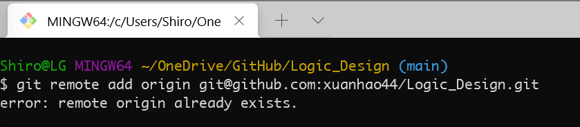
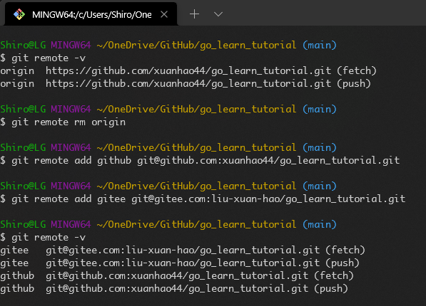
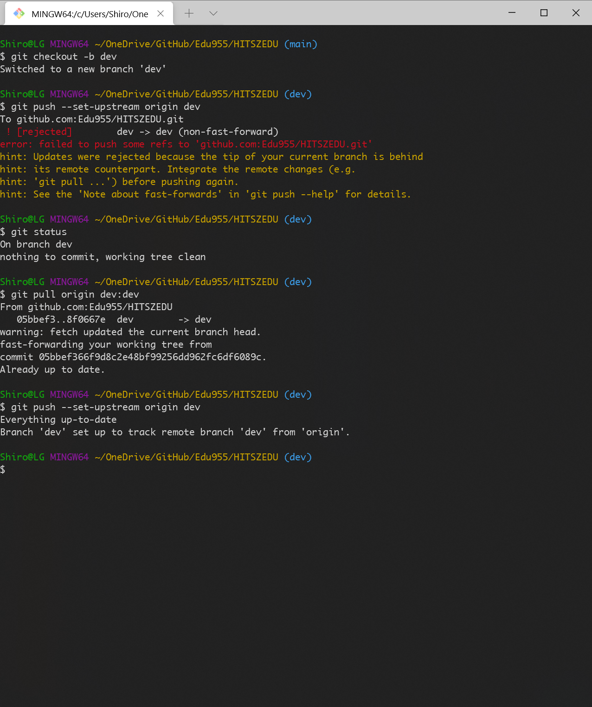

# 远程仓库和本地仓库

## 本地 Git 仓库和 GitHub 仓库的 SSH 加密传输

略，见教程。

## 拉取远程仓库到本地

### 初始的情景

已经有一个远程仓库，我们首先要做的是：

1. 将这个仓库克隆到本地。
    ```git clone git@github.com:xuanhao44/learngit.git```
    使用的是 SSH key。

2. 进入仓库目录。
    ```cd learngit```
    也可以直接打开仓库的文件夹，在那里 git bash。

3. 建立远程仓库和本地仓库之间的关联。
    ```git remote add origin git@github.com:xuanhao44/learngit.git```
    origin 是远程库的名称。

  似乎自己的仓库克隆下来事不需要这第 3 步的.

  

### 之后的情景

1. 本地仓库的代码进行修改后需要推送到远程仓库。
2. 远程仓库的更改优先于本地仓库，本地仓库需要跟进。
3. 删除本地仓库和远程仓库的关联。

#### 本地仓库的代码进行修改后需要提交到远程仓库

1. 本地仓库修改（add 和 commit 默认已经完成）之后，**第一次**推送：
```git push -u origin main```
2. 之后的推送：
```git push origin main```

#### 远程仓库的更改优先于本地仓库，本地仓库需要跟进

比上一个多出来的步骤就是拉取远程仓库代码并与本地版本合并。
```git pull origin main```
将远程主机 origin 的 main 分支拉取过来，与本地的 main 分支合并。
之后就是和 1 相同的操作了。

#### 删除本地仓库和远程仓库的关联

1. 删除需要远程库的名称，先使用命令查看名称。
```git remote -v```
2. 根据名字删除关联。
```git remote rm origin```

## 删除关联的情景

1. 远程仓库的仓库名发生了更改，导致 SSH 变动。
   这个时候就需要先删除关联，再用新的 SSH 来建立新的关联。但还有几个问题：
   
   1. 原来未解除关联的 SSH 似乎还能坚持一段时间，即使仓库名变动，也还能用原来的 SSH 正常的进行操作?
   
      答：TODO
   
   2. 本地的仓库名会随着 `git pull` 而变化吗？
   
      答：git 系统里的仓库名是会变的，但是这个时候文件夹的名字并没有跟着变化。
   
2. 我需要把本地的库和多个远程库关联，不仅仅是 github，还有 gitee。
   这个时候也需要删除关联。我们之前一直使用的是`git remote add origin git@github.com:xuanhao44/learngit.git`，现在我们知道`origin` 是远程库的名称（叫别名也行），所以这次重新关联的时候就写成：
   ```git remote add github git@github.com:xuanhao44/learngit.git```



## 多分支的仓库的远程和本地的连接

初始:

1. 创建并切换: `git checkout -b dev`
2. 拉取 git pull origin <远程分支名>:<本地分支名>: `git pull origin dev:dev`
3. 将本地分支与远程同名分支相关联: `git push --set-upstream origin <本地分支名>`



后续: 将与本地当前分支同名的**远程分支拉取到本地当前分支**上(**需先关联远程分支**）`git pull origin dev`

## 创建仓库的情景

先在 github 上创建仓库.

拉取远程仓库到本地.

在本地操作,再 push.

这并不是在本地创建仓库的流程。

